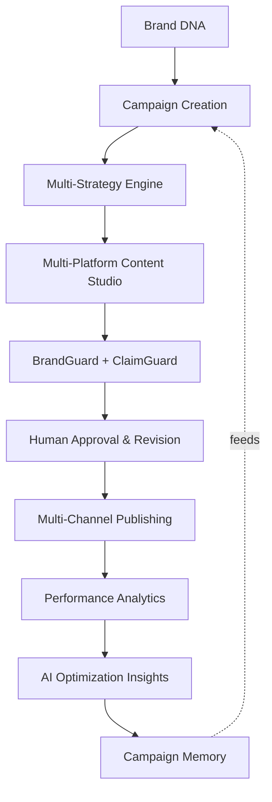
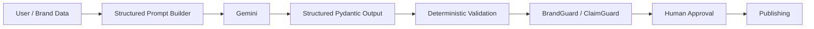

# 🔥 BrandForge AI

### From Brand DNA to Campaign.

An AI-powered content and campaign studio that turns brand knowledge, products, audience, and goals into **brand-consistent, platform-native marketing campaigns**, with governance, approval, analytics, and memory built in.


**AI Recommends. Policy Engine Decides. Human Approves.**

[Why](#-why-brandforge) · [Workflow](#-how-it-works) · [Features](#-features) · [Architecture](#-architecture) · [Quick Start](#-quick-start) · [API](#-api-overview) · [Testing](#-testing)


---

## 💡 Why BrandForge?

Keeping marketing content consistent across platforms is hard. Teams have to juggle:

- Brand voice and positioning
- Audience relevance
- Platform-specific formats
- Claim accuracy
- Approval workflows
- Publishing schedules
- Performance tracking
- Lessons from past campaigns

BrandForge brings all of this into **one closed-loop system**. It generates campaigns from your Brand DNA, audits them with **BrandGuard** and **ClaimGuard**, routes them through human approval, schedules them, tracks performance, and turns results into reusable **Campaign Memory** for the next campaign.

---

## 🔁 How It Works



This is a continuous learning loop, not a one-shot content generator.

---

## ✨ Features

| | Feature | What it does |
|---|---|---|
| 🧬 | **Brand DNA** | Central brand knowledge: identity, voice, audience, pillars, products, positioning, Do/Don't rules, visual direction |
| 🧭 | **AI Campaign Strategy** | Three distinct directions to choose from: Product-Led, Story-Led, Community-Led |
| ✍️ | **Content Studio** | Platform-native content for Instagram, LinkedIn, X, and YouTube Shorts |
| ♻️ | **Content Repurposing** | Turn one asset into platform-specific derivatives using the same governance pipeline |
| 🛡️ | **BrandGuard** | Audits content against Brand DNA and returns `PASS`, `WARNING`, or `FAIL` |
| ⚠️ | **ClaimGuard** | Flags absolute, superlative, quantitative, performance, and sustainability claims that lack evidence |
| ✅ | **Approval & Revisions** | Submit, approve, request changes, reject, revise, re-audit, with full history |
| 📅 | **Publishing Calendar** | Month, week, and list views with filters, rescheduling, cancellation, and history |
| 📊 | **Analytics** | Validated metrics: impressions, reach, engagement, CTR, conversion rate, and more |
| 🧠 | **AI Optimization** | Recommendations on strategy, platform mix, format, tone, and CTAs |
| 🗂️ | **Campaign Memory** | Evidence-linked learnings reused in future campaigns |

### Content Studio

Each generated asset includes a **concept, hook, body/copy, CTA, visual direction**, and platform-specific formatting. Assets can be regenerated individually and copied straight from the UI.

### BrandGuard & ClaimGuard

BrandGuard checks voice, audience, messaging pillars, positioning, Do/Don't rules, concept, and visual direction.

ClaimGuard never silently accepts a risky claim. It calls it out explicitly:

> ⚠️ *Unsupported claim: evidence not found in the provided brand/product knowledge.*

### Human Approval & Revision

AI output is **never automatically publishable**. Revising content invalidates its previous audit, so changes must be re-audited before approval. Every step is traceable through revision history and approval history.

### Publishing

Approved content can be scheduled across Instagram, LinkedIn, X, and YouTube Shorts, with status tracking, quick rescheduling, cancellation, failure simulation, and retry handling.

> **Note:** Publishing is clearly marked **DEMO / SYNTHETIC**. It uses simulated external post IDs and does not call real social-platform APIs.

### Analytics

Metrics are validated before they are stored:

```text
Engagement Rate = (Likes + Comments + Shares + Saves) / Reach × 100
CTR             = Clicks / Impressions × 100
Conversion Rate = Conversions / Clicks × 100
```

Impossible data, such as clicks exceeding impressions or conversions exceeding clicks, is rejected.

### Campaign Memory

Learnings are stored by category (strategy, platform, claim risk, approval patterns, performance, content format), and each one links back to the campaign, content, audit, or approval evidence behind it.

---

## 🏗️ Architecture

BrandForge uses a **hybrid AI architecture**. The LLM generates and analyzes, while deterministic code makes the rules-based decisions.



| 🤖 The LLM handles | ⚙️ The application controls |
|---|---|
| Campaign strategy generation | Governance rules |
| Content generation | Validation and approval gates |
| Content repurposing | Scheduling rules and publishing state |
| Creative recommendations | Metric validation |
| Performance insights | Audit freshness and revision invalidation |
| Optimization recommendations | Persistence and traceability |

This separation means an AI recommendation is never treated as an authoritative business decision.

### Safety & Validation

Application-level controls cover unsupported claims, invalid metrics, stale audits, unapproved content, revisions after scheduling, duplicate schedules, invalid publishing states, simulated failures, and approval state transitions.

For example, when already-scheduled content is revised, its schedule is cancelled and it must pass audit and approval again before it can be rescheduled.

---

## 🧰 Tech Stack

| Layer | Technologies |
|---|---|
| **Frontend** | React, TypeScript, Vite, Tailwind CSS |
| **Backend** | Python, FastAPI, Pydantic, SQLAlchemy |
| **AI** | Google Gemini (structured generation) with deterministic fallback |
| **Database** | SQLite for local dev, PostgreSQL-ready |
| **Tooling** | Git, GitHub, Pytest, npm, Vite production builds |

---

## 🚀 Quick Start

### Prerequisites

- Python 3.11+
- Node.js and npm
- Git
- A Gemini API key (for live AI generation)

### 1. Clone

```bash
git clone https://github.com/Saibikdey/BrandForge-AI.git
cd BrandForge-AI
```

### 2. Backend

```bash
cd backend
python3 -m venv .venv
source .venv/bin/activate
pip install -r requirements.txt
cp .env.example .env     # then add your Gemini API key
uvicorn app.main:app --reload --port 8001
```

Health check: `http://127.0.0.1:8001/api/health`

### 3. Frontend

In a second terminal, from the project root:

```bash
npm install
npm run dev
```

Open the URL Vite prints in the terminal.

### Environment Variables

```env
GEMINI_API_KEY=your_gemini_api_key
DATABASE_URL=sqlite:///./brandforge.db
```

SQLite is the default. The database layer is structured to support PostgreSQL.

### Production Build

```bash
npm run build    # output goes to dist/
```

---

## 🎬 Demo Flow

```text
Brand DNA → Create Campaign → Select Strategy → Generate Content → BrandGuard
→ Human Approval → Schedule → Publish (Demo) → Add Performance → Analytics
→ Optimization → Campaign Memory
```

<!-- Add screenshots or a GIF here, e.g.  -->

---

## 🔌 API Overview

#### Brand

```text
GET    /api/brands/current
PUT    /api/brands/current
GET    /api/brands/current/products
```

#### Campaigns & Strategies

```text
POST   /api/campaigns
GET    /api/campaigns/{campaign_id}
POST   /api/campaigns/{campaign_id}/generate-strategies
GET    /api/campaigns/{campaign_id}/strategies
PATCH  /api/campaigns/{campaign_id}/strategies/{strategy_id}/select
```

#### Content

```text
POST   /api/campaigns/{campaign_id}/content/generate
GET    /api/campaigns/{campaign_id}/content
POST   /api/content/repurpose
POST   /api/campaigns/{campaign_id}/content/repurpose
```

#### Governance

```text
POST   /api/content/{content_id}/audit
GET    /api/content/{content_id}/audit
POST   /api/campaigns/{campaign_id}/audit
```

#### Approval

```text
GET    /api/content/{content_id}/approval
POST   /api/content/{content_id}/submit-review
POST   /api/content/{content_id}/request-changes
POST   /api/content/{content_id}/approve
POST   /api/content/{content_id}/reject
POST   /api/content/{content_id}/revisions
```

#### Publishing

```text
POST   /api/content/{content_id}/schedule
GET    /api/content/{content_id}/schedule
GET    /api/campaigns/{campaign_id}/calendar
GET    /api/calendar
PATCH  /api/schedules/{schedule_id}
POST   /api/schedules/{schedule_id}/cancel
POST   /api/schedules/{schedule_id}/publish-demo
GET    /api/schedules/{schedule_id}/history
```

#### Analytics

```text
GET    /api/analytics
GET    /api/campaigns/{campaign_id}/analytics
GET    /api/content/{content_id}/analytics
POST   /api/campaigns/{campaign_id}/performance
POST   /api/content/{content_id}/performance
POST   /api/analytics/demo-seed
```

#### Campaign Memory & Optimization

```text
GET    /api/memory
POST   /api/memory/refresh
GET    /api/memory/insights/{insight_id}
GET    /api/campaigns/{campaign_id}/memory
GET    /api/optimization/recommendations
```

---

## 🧪 Testing

```bash
cd backend
source .venv/bin/activate
pytest -q
```

The suite covers Brand DNA, campaign creation, strategy generation and selection, content generation and repurposing, BrandGuard, ClaimGuard, human approval, revisions, scheduling and publishing, analytics and performance ingestion, Campaign Memory, optimization, system settings, and the full closed-loop workflow.

---

## 📁 Project Structure

```text
BrandForge-AI/
├── backend/
│   ├── app/
│   │   ├── routers/
│   │   ├── services/
│   │   ├── models/
│   │   ├── schemas.py
│   │   ├── config.py
│   │   ├── database.py
│   │   └── main.py
│   ├── tests/
│   └── .env.example
├── src/
│   ├── components/
│   ├── screens/
│   ├── services/
│   ├── types/
│   └── App.tsx
├── index.html
├── package.json
├── tsconfig.json
├── vite.config.ts
└── README.md
```

---

## 🎨 Design

A dark editorial interface built around clear information hierarchy, editorial typography, minimal visual noise, data-focused dashboards, responsive layouts, and clear governance states. The goal is to make AI-generated content **understandable and reviewable**, not a black box.

---

## 🏆 Built For

**Build Fast with AI: AI Build Challenge 2026**, a challenge to build an AI-powered content studio for brands and creators, with an emphasis on practical AI and a working end-to-end product.
[Official hackathon page](https://www.buildfastwithai.com/hackathon)

---

## 👤 Author

**Saibik Dey**  
Computer Science & Engineering  
Dayananda Sagar College of Engineering

[GitHub](https://github.com/Saibikdey)
